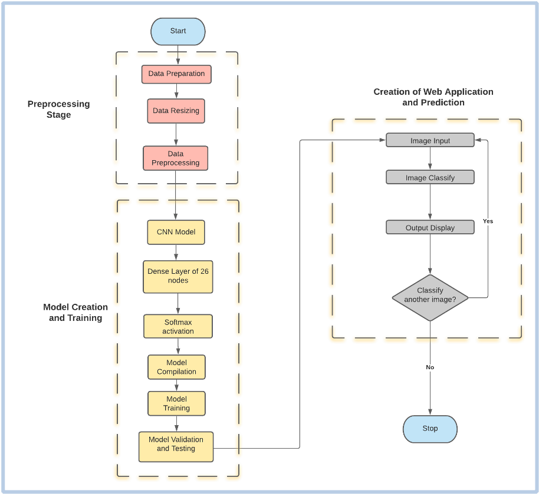
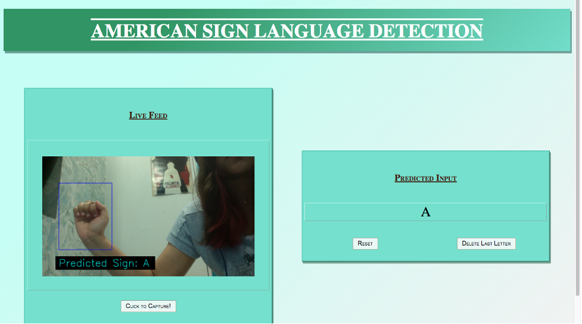
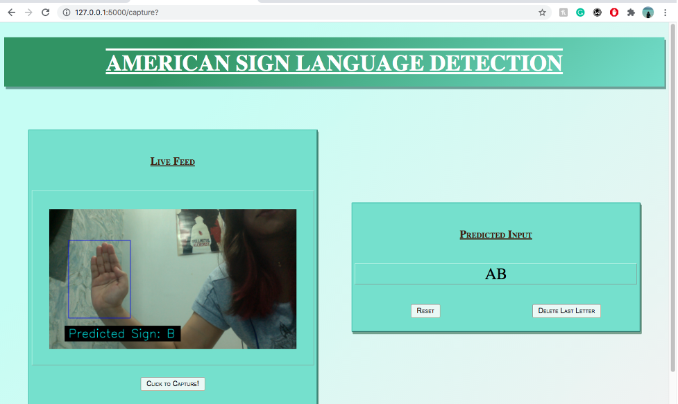
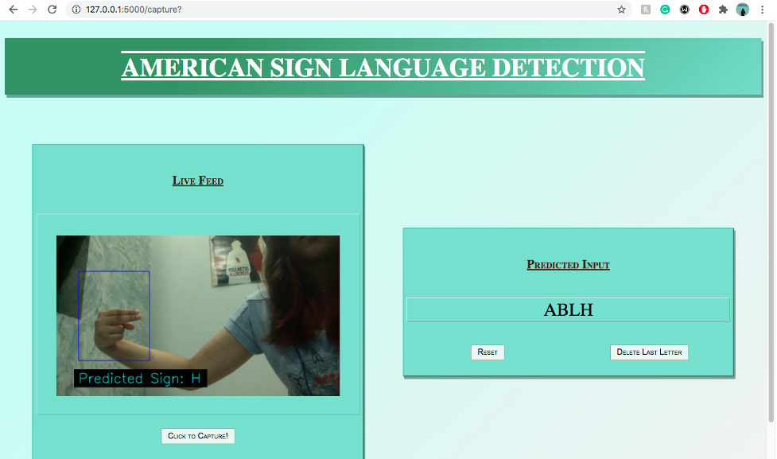

# Sign Language Detector README


# 1. Introduction

## 1.1. Overview

- Strives in aiding the deaf community by making sign language more accessible.
- Real-time video captured with OpenCV and a 3-layer CNN detects and translates hand gestures.
- Uses a web app created with Flask, making it platform-independent and allowing users to sign without a translator.

## 1.2. Abstract

This project is a web application that includes a webpage that streams live video captured from the user’s webcam. In this real-time video, a blue box is present, inside of which the user is expected to sign the alphabet they want to be interpreted.
The application is thus taken as an image input from the user, containing an alphabet of the ASL. It then proceeds to classify and display the corresponding letter on the same page.

# 2. Implementation

## 2.1. Flow Chart



## 2.2. Dataset

The dataset used here is from MNIST. It is presented here in CSV format with labels and pixel values in single rows. 

The American Sign Language letter database of hand gestures represents a multi-class problem with 24 classes of letters (excluding J and Z which require motion). 

The dataset is already separated into train and test cases and its format is patterned to match closely with the classic MNIST. 

Each training and test case represents a label (0-25) as a one-to-one map for each alphabetic letter A-Z (and no cases for 9=J or 25=Z because of gesture motions). 

We are considering a total of 26 labels for ease of understanding. 

The training data (27,455 cases) and test data (7172 cases) are approximately half the size of the standard MNIST but otherwise similar with a header row of label, pixel1,pixel2….pixel784 which represent a single 28x28 pixel image with grayscale values between 0-255.

## 2.3. Data Preprocessing

The data is separated into labels and pixels. 

The image set is converted into a numpy array and is then resized into a 28 x 28 matrix. 
The label set is converted into a one-hot vector.   

The input to the CNN must be of the format: (no. of images, rows, columns, channels [1 for black and white]).  Hence, the train and test datasets are again reshaped into: (-1,28,28,1) 

The pixels are divided by 255.0 (maximum value) to normalise. Normalisation makes the training process much faster. It is easier to train a neural network with data which lies between 0-1.

## 2.4. Creation of the Model

A CNN model of three layers and 26 classes is developed. 

The model type that is used here is Sequential. 
Sequential is the easiest way to build a model in Keras as it enables the creation of a model layer by layer. All three layers in the model are Conv2D layers. These are convolution layers that will deal with the input images, which are seen as 2-dimensional matrices.  

64 in the first layer and 128 in the second layer and 256 in the third layer are the number of nodes in each layer. This number can be adjusted to be higher or lower, depending on the size of the dataset. In this case, 64, 128 and 256 worked well, so these numbers were finalized for the model.  Kernel size is the size of the filter matrix for our convolution. So a kernel size of 3 means we will have a 3x3 filter matrix.

The activation function used for the 3 layers is the ReLU, or Rectified Linear Activation function as this activation function has been proven to work well in neural networks. 

The first layer also takes an input shape, which is the shape of each input image: (28,28,1). Here, 1 signifies that the images are grayscale.  In between the Conv2D layers and the dense layer, there is a ‘Flatten’ layer. Flatten serves as a connection between the convolution and dense layers.

‘Dense’ is the layer type used for our output layer as it is a standard layer type that is used in many cases for neural networks. There are 26 nodes in the output layer, one for each possible outcome (A-Z). The activation used in the output layer is ‘softmax’. Softmax makes the output sum up to 1 so the output can be interpreted as probabilities. The model will then make its prediction based on which option has the highest probability.

The model is now compiled. Compiling the model takes three parameters: optimizer, loss and metrics. The optimizer controls the learning rate. For this model, Adam Optimizer has been used. For the loss function, ‘categorical_crossentropy’ has been used. The ‘accuracy’ metric has been used to see the accuracy score on the validation set while training the model.

## 2.5. Training and Testing

For training the model the ‘fit()’ function is used with the following parameters: 
training data (x_train), target data (y_train), validation data, number of epochs, batch size, steps per epoch and validation steps. 

For the validation data, the test set provided in the dataset is used(x_test,y_test). 

The number of epochs is the number of times the model will cycle through the data. The more the number of epochs, the more the model will improve, up to a certain point. After that point, the model will stop improving during each epoch. 

For this model, the number of epochs are set to 12. Then the model is evaluated, where the ‘evaluate()’ function is used with the following parameters: x_test, y_test and verbose. 

After the completion of training and testing, the model is saved. This means the model can resume where it left off and avoid long training times.

## 2.6. Creation of Web Application

For the development of the web application, we utilise Flask. Since the application that we are about to create depends on several different files, it is crucial to create a single project folder that encompasses all the required files. The structure of our web application is as follows:

$flask_final <br />
│   └──── index.py <br />
│   └──── model.h5 <br />
│   └──── static <br />
│   │   └──── style.css <br />
│   └──── template <br />
│   │   └── index.html <br />

As mentioned above, flask_final is the folder inside of which all the required files are present; including our main .py script that hosts our main flask framework. Subfolders static and template holds the .css and the .html files respectively.

### 2.6.1. Integrating HTML with FLASK

First and foremost, the previously saved model is loaded and a dictionary of each alphabet corresponding to its labels is created.  Moving on, an instance ‘app’ of the class ‘Flask’ is initialised with the template_folder=‘template’. The app route for the default page is defined where routes refer to url patterns of an app.

@app.route(“/”) is a Python decorator that Flask provides to assign URLs in the app to function easily. Flask uses the Jinja template library to render templates.

In this application, templates are used to render HTML which will then be displayed on the browser.

The ‘/video’ route returns the streaming response which are the images that are to be displayed on the web page. The URL to this route is in the “src” attribute of the image tag in the html file.

In the header section of the html file, the css stylesheet is loaded which is present inside the static folder. It uses {{ url_for() }} to do so. In the body, it contains the main table which splits the webpage into two sections. In the right section, is the img tag with the src attribute that links to the route ‘/video’.

As a response to it, the method gen() is called which employs openCV to capture the live video from the user’s webcam.  A blue rectangular box is displayed on the screen, inside of which the user is expected to hold up their hand and sign the alphabet which they want to be interpreted.

The sign is then cropped, converted to grayscale and sized to 28 x 28, in order to match the specifications of the model.

### 2.6.2. Prediction from User Input

A method named recognise is then called with this image in its parameter. Once again, we resize the NumPy array corresponding to this image [28x28x1] to accommodate the number of channels into its dimension. From the previously imported model, model.predict is called with the processed image in its parameter, and in return, we get a list of all the classes with their corresponding probabilities. The output with the maximum probability is then extracted, matched to its corresponding label and then returned back to the gen() function from where it was called.  This predicted label is then displayed at the bottom of the screen.  The Response of the ‘/video’ route ensures that the yield of the gen() function is being constantly streamed, while its parameter, mimetype='multipart/x-mixed-replace; boundary=frame’ makes sure that each captured image replaces the old frame so that the frames appear as a live streaming video on the webpage.  If the user is satisfied with the predicted alphabet that is being displayed at the bottom of the screen, they can click on the capture button which will invoke the ‘/capture’ route and concatenate the predicted character with the output string.

# 3. Outputs and Results

## 3.1. Results

- The hierarchical model provided a training loss of 0.0249, thus translating to a training accuracy of 99.2% and a validation accuracy of 97.2% for categorizing one-handed features.
- However, due to the similarity of some letters, the model gets confused. We concur that this can be overcome by increasing the dimension of the images in the training dataset, but since it can be quite taxing on the computer, we opted for 28x28 images.
- The model can be improved by collecting more quality data, increasing image resolution or trying more convolutional neural network architectures.
- On testing the model an accuracy of 97.23% and a loss of 0.1385 was achieved.

## 3.2. Screenshot of Outputs:



The signed alphabet is predicted in the live feed.



Once the user is satisfied with the prediction, they can choose to capture it, which will concat the sign in the output string.



Furthermore, the user has the ability to delete any alphabet in the string, so that they can re-sign it.

# 4. Installation and Running Guide

## 4.1. Installing Dependencies

Make sure that you have Python installed. 

Open up the terminal and navigate to the folder where the project is located using ‘cd’.

 Now, in the terminal write the following commands:

```bash
pip install Flask
pip install opencv-python
```

## 4.2. Running the application

In the terminal, navigate to the folder in which the index.py is using the ‘cd’ command. 
Once you are in the directory, run the application by typing the following command:

```bash
python index.py
```

This will start the Flask development server and the application will be available at http://localhost:5000

You can stop the program by pressing CTRL+C

# 5. Conclusion

Sign language recognition is a tough problem, considering the fact that there are a couple of zillion possible combinations of gestures that a system of this kind needs to understand and translate. That being said, probably the best way to solve this problem is to divide it into simpler ones, and the system presented here would correspond to a possible solution to one of them, which is spelling out particular words letter by letter.

Since the main motive of this project was to create a complete web application, the workflow was divided into two sections, one focusing on building the model and the other integrating the model with the web framework.

The model built in this project performed well, but there were a few exceptions that occurred due to the similarity in a couple of signs.  Conclusively, even though complete accuracy was not achieved, the main feat was reached and henceforth, emphasis should be given on further analysing the solution and studying ways to improve the system.

# References

1. kaggle datasets download -d datamunge/sign-language-mnist
2. Z. Zhang, "Improved Adam Optimizer for Deep Neural Networks," 2018 IEEE/ACM 26th International Symposium on Quality of Service (IWQoS), 2018, pp. 1-2, doi: 10.1109/IWQoS.2018.8624183.
3. LeCun Y.A., Bottou L., Orr G.B., Müller KR. (2012) Efficient BackProp. In: Montavon G., Orr G.B., Müller KR. (eds) Neural Networks: Tricks of the Trade. Lecture Notes in Computer Science, vol 7700. Springer, Berlin, Heidelberg.
